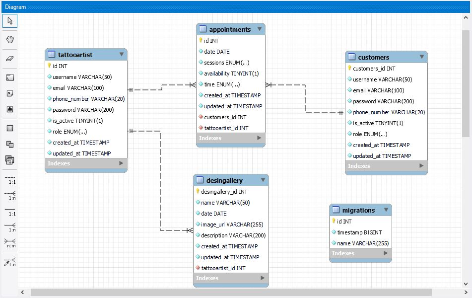

<h1 align="center"> Appointments Management System</h1>​
​
<h2 align="center">Backend application for a tattoo studio centre</h2>

## Table of contents
- Title project
- Project description
- Reverse Engineer
- How to use the application
- Technologies Used
- Licence and copyright

### Project descriptión
We have started the proposal to develop a backend web application to simulate the management of appointments in a tattoo studio centre, in which we have mainly used the tools typeorm, mysql workbench, postman to generate different endpoints to the users that will enter the application. In this case we focus on the design of entity models to obtain a **customers** table composed of the following properties: id, username, email, password, phone_number, is_active, role, where it has a relation  

>>  @OneToMany(() => Appointment, (appointment) => appointment.customers)
>>appointments!: Appointment[];

then we find the entity **tattooartist** with the properties id, username, email, phone_number, password, is_active, role, with a relationship of 
>> @OneToMany(() => Appointment, (appointment) => appointment.tattooartist)
>> appointments!: Appointment[];

>>@OneToMany(() => Desingallery, (desingallery) => desingallery.tattooartist)
>>desingallerys!: Desingallery[];

then the **appointment** entity with the properties id, date, sessions, availability, time with a relation  

>>@ManyToOne(() => Customers, (customers)=>customers.appointments)
>> @JoinColumn({name: "customers_id"})
>> customers!: Customers [];
  
>>@ManyToOne(() => Tattooartist, (tattooartist) => tattooartist.appointments)
>>@JoinColumn({name: "tattooartist_id"})
>>tattooartist!: Tattooartist [];

and finally the **desingallery** entity with properties id, name, date, imag, description, with a relationship of 
>> @ManyToOne(() => Tattooartist, (tattooartist) => tattooartist.desingallerys)
>>@JoinColumn({name: "tattooartist_id"})
>>tattooartist!:Tattooartist;

### Reverse Engineer

### how to use the application
- **install vscode extension Thunderclient or postman**
- **Install node**  
- **install express**  
- **install typeORM**  
- **install dotenv** 
- **install mysql workbench** 
- run the command **npm run dev**  in the terminal
- create a user by inserting directly BBDD
​
### Technologies Used
​

  <tr >
    <td valign="top"></td>
    <td valign="top"></td>
    <td valign="top"></td>
    <td valign="top"></td>
     <td valign="top"></td>

### Endpoints

### customer/register
>> POST   http://localhost:4000/customer/register
>>{
  >>"success": true,
  >>"message": "user created succesfully",
  >>"customer": {
  >>"username": "jose",
  >>"email": "jomo@gmail.com",
  >>"password": "$2b$10$evszSUD9EUbtGenfDHe0cuHakneXnoCSYrSJWIM2HmiuBvoKFD5rC",
  >>"phone_number": "8299236045",
  >>"customers_id": 3
  >>}
>>}

### customer/login
>>POST http://localhost:4000/customer/login
>>{
>>    "success": true,
>>    "message": "user logged succesfully",
>>    "token":
>>"eyJhbGciOiJIUzI1NiIsInR5cCI6IkpXVCJ9.>>eyJjdXN0b21lcnNfaWQiOjEwLCJyb2xlIjoiYWRtaW4>>iLCJlbWFpbCI6Imx1aXMwMjVAZ21haWwuY29tIiwiaW>>F0IjoxNjk5NjQwMjA3LCJleHAiOjE2OTk2NTEwMDd9.>>aqWLWsBZog757RC1u_0yWZJt5ZhK0mG2n61zskmNjq0>>"
>>}

### customer/profile
>>GET http://localhost:4000
>>{
>>    "success": true,
>>    "message": "profile customer retrieved",
>>    "date": {
>>        "customers_id": 10,
>>        "username": "luis",
>>        "email": "luis025@gmail.com",
>>        "password": "$2b$10$kI84mg3GDmoQ7IyCqTmCr.swK58OOcsFb3Erkvhbmb4hWSl1cMbAm",
>>        "phone_number": "8299236045",
>>        "is_active": true,
>>        "role": "admin",
>>        "created_at": "2023-11-09T14:21:01.000Z",
>>        "updated_at": "2023-11-09T14:21:01.000Z"
>>    }
>>}

### appointment/appointment_create
>>POST http://localhost:4000/appointment/appointment_create
>>{
>>"appointment": {
>>"tattooartist_id": 10,
>>"customers_id": "2",
>>"time": "12:00",
>>"sessions": "piercing",
>>"date": "2023-10-11",
>>"availability": "1",
>>"id": 5
>>}
>>}

### /appointment/appointment_update
>>PUT http://localhost:4000/appointment/appointment_update/5
>>{
>>"updateAppointment": {
>>"id": 5,
>>"date": "2023-10-10T22:00:00.000Z",
>>"sessions": "piercing",
>>"availability": false,
>>"time": "09:00",
>>"created_at": "2023-11-10T17:18:27.000Z",
>>"updated_at": "2023-11-10T17:45:43.000Z",
>>"customers_id": 2,
>>"tattooartist_id": 10
>>}
>>}

### appoinment/appointments_get_all
>> GET  http://localhost:4000/appointment/appointments_get_tattoo
>>{
>>"id": 3,
>>"date": "2023-11-04T23:00:00.000Z",
>>"sessions": "tattoo",
>>"availability": false,
>>"time": "09:00",
>>"created_at": "2023-11-05T15:43:01.000Z",
>>"updated_at": "2023-11-08T17:45:33.000Z",
>>"customers_id": 4,
>>"tattooartist_id": 1
>>}

>>{
>>"id": 4,
>>"date": "2023-10-10T22:00:00.000Z",
>>"sessions": "piercing",
>>"availability": false,
>>"time": "12:00",
>>"created_at": "2023-11-10T17:17:11.000Z",
>>"updated_at": "2023-11-10T17:17:11.000Z",
>>"customers_id": 4,
>>"tattooartist_id": 10
>>},
>>{
>>"id": 5,
>>"date": "2023-10-10T22:00:00.000Z",
>>"sessions": "piercing",
>>"availability": false,
>>"time": "12:00",
>>"created_at": "2023-11-10T17:18:27.000Z",
>>"updated_at": "2023-11-10T17:18:27.000Z",
>>"customers_id": 2,
>>"tattooartist_id": 10
>>}

### appoinment/appointments_delete/5
>>DELETE http://localhost:4000/appointment/>>appointment_delete/5
>>{
  >>  "message": "Appointment delete success"
>>}

### Grateful
First of all to my colleagues who have contributed their opinions at opportune moments to make all the information seen in the classroom more fluid, to the existence of applications such as stack overflow, tutorials on the subject.  
​
### Licence and copyright

📝 The copyright belongs to me Meriyen Rodriguez, in this web application proposed by the Geekshubs academy as the first backend version to later give continuity to the fronend version.
